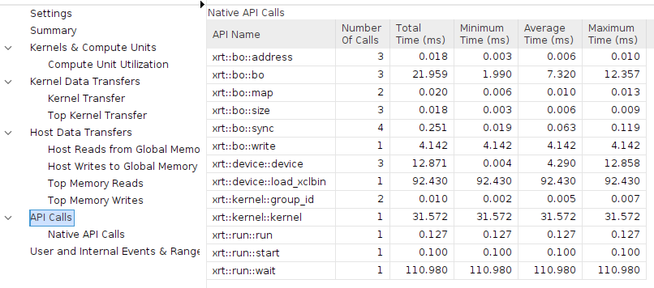
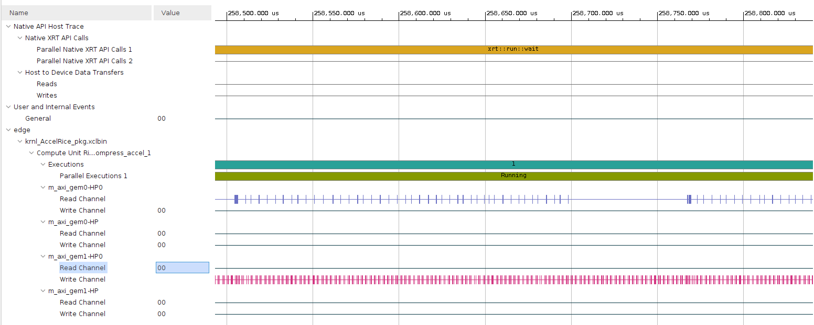

# CFA Compress

This is a CFA losslelly compression algorithm

## Setup
Xilinx goes out of their way to make life difficult. Using the HLS tools
requires an ANCIENT compiler. But if you source the HLS envionment, then
you will get an ANCIENT cmake version, which will not work for OpenCV.

Oh, and you need a custom build of OpenCV for the ANCIENT compiler. It is
ridiculous. So.. You need to build OpenCV with the old compiler.

Define the following environment variable:
`
export CXX=<vitis HLS dir>/tps/lnx64/gcc-8.3.0/bin/g++
export LIBRARY_PATH=/usr/lib/x86_64-linux-gnu/:$LIBRARY_PATH
`

DO NOT SOURCE VITIS_HLS IT WILL BREAK EVERYTHING

Now run:
`make opencv`

Now you can source the setup environment
`. env.sh`

## Build/SIM
`make run CSIM=1`
This will build the Vitis C simulation

## Synth
`make run CSYNTH=1`

This will synthesize the design into RTL

## Cosim
`make run COSIM=1`
This will run a logic simulation

## Vitis accelerated kernel
This will produce the vitis accelerated kernel and the sd_card image.

    make vitis
    make sd_card

You can now copy the `BOOT.BIN` and `krnl_AccelRice.xclbin` files to the target

## Build Reference Implementation
`make ref`
This will build a non Vitis reference implementation using the currently
defined CXX variable

This is a reference implementation that will test the software version
and the hardware accelerated version on target.

This should result in the following output:

    root@plinux:~# ./ref big.png
    Is image Contiguous: 1
    device name:     edge
    device bdf:      0000:00:00.0
    Ch: 0 size: 603819
    Ch: 1 size: 586624
    Ch: 2 size: 507620
    Ch: 3 size: 603917
    XRT time took 252.530045 ms
    Compressed size: 2302012  Uncompressed size: 4658048  Ratio: 49.4%
    Header stuff took 38.547039 ms
    HW Accel Total Compression time took 291.824951 ms
    Header is good
    Assembling image
    Sum of diff: 0.000000
    IMAGES MATCH
    Saving vector to file comp3.cfa

The first time you run the xrt xclbin load function, it does a bunch of setup
work. This can take some time. The next time you run the `ref` program the
xclbin load is much faster. In a production application this would only be done
once on startup.

What the text above shows it how long the XRT (accelerated portion took),
and how long it took to take the output data and wrap it in a `.cfa` file.

There is opporuntity to improve the software performance.

The image below shows the API execution times for the XRT portion. The run and
wait times are how long it takes to run the accelerator.

Below is a timeline trace. You can see the reads are perforrmed in bursts.
But the writes are written out in a sort of burst method.

